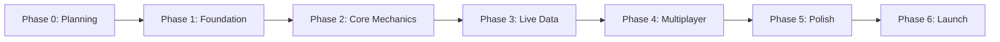

# 🎯 Master Project Phases

This is the central planning document for the Crypto Trading Simulator. All other planning documents support the phases outlined here.

> **🚨 IMPORTANT**: Want the absolute fastest path to something on screen? See [BARE-MINIMUM-PLAN.md](BARE-MINIMUM-PLAN.md) for a 2-hour version that ships just the essentials.

## Minimum Viable Product Analysis

### Absolutely Essential (Can't cut)
- Phaser project with web deployment
- At least ONE screen showing something
- Basic interactivity (a button)

### Everything Else (Can be cut for MVP)
- Multiple screens → Start with 1
- Navigation → Not needed initially  
- Allocation system → Can add later
- Live data → Mock data or static is fine
- Backend → Local only first
- Multiplayer → Single player first
- Polish → Ship ugly, improve later

## Planning Document Structure

```
planning/
├── phases.md (this file - full plan)
├── BARE-MINIMUM-PLAN.md (2-hour quick ship)
├── phase1-foundation.md (Phaser setup & navigation implementation)
├── phase2-mechanics.md (Allocation system implementation)
├── phase3-data.md (Dashboard & CoinGecko API implementation)
├── phase4-multiplayer.md (Backend implementation)
├── phase5-polish.md (Polish & optimization tasks)
├── setup-guide.md (Complete technical setup)
├── quick-start.md (5-minute first screen guide)
└── troubleshooting.md (Common issues & solutions)
```

## Phase Overview



> **Note**: You can ship after Phase 1 Milestone 0 and have a working game!

---

## ✅ Phase 0: Planning & Setup (COMPLETE)
**Duration**: 1 day  
**Status**: ✅ Complete

### Objectives
- Define project scope and requirements
- Create comprehensive planning documentation
- Set up development environment
- Initialize project structure

### Deliverables
- ✅ Master phases document
- ✅ Phase-specific implementation guides
- ✅ Git repository with .gitignore
- ✅ Memory bank for agents
- ✅ Folder structure

### Success Criteria
- Anyone can understand and build the project
- Clear phase execution plan
- Infrastructure ready for development

---

## 🚧 Phase 1: Foundation (Current)
**Duration**: 1 day  
**Status**: Ready to start  
**📋 Implementation Guide**: [phase1-foundation.md](phase1-foundation.md)

### Objectives
- Set up Phaser project with first visible output
- Create login screen with test users
- Create main game screens
- Implement navigation between screens
- Establish visual style

### Milestones
- **Milestone 0**: Login screen with 2 test users (2 hours) ⭐ **MINIMUM SHIPPABLE**
- **Milestone 1**: Screen navigation system (2 hours) *Builds on login system*

> **Test Users for MVP**: Both start with $10M. Alice → $12M (+20%), Bob → $8M (-20%) - showing how different investment choices lead to different outcomes

### Deliverables
- [ ] Phaser project created
- [ ] Welcome screen with gradient
- [ ] All 4 screens (empty but styled) *Can cut to 1 screen*
- [ ] Scene navigation working *Can cut entirely*
- [ ] First web build deployed

### Success Criteria
- Can navigate through entire game flow *Or just one screen for MVP*
- Consistent visual styling (black/cyan/pink)
- Runs in web browser
- < 5 second load time

---

## 📊 Phase 2: Core Mechanics
**Duration**: 1 day  
**Status**: Upcoming  
**📋 Implementation Guide**: [phase2-mechanics.md](phase2-mechanics.md)

> **MVP Note**: This entire phase can be deferred. Ship Phase 1 Milestone 0 first!

### Objectives
- Build portfolio allocation system
- Implement 100-point distribution
- Create data persistence
- Design reusable UI components

### Milestones
- **Milestone 2**: Allocation mechanics (4 hours)

### Deliverables
- [ ] Crypto allocation screen with 5 currencies
- [ ] Slider system with constraints
- [ ] Real-time total calculation
- [ ] Lock mechanism
- [ ] Data saved between scenes

### Success Criteria
- Intuitive allocation interface
- Cannot proceed without valid allocation (total = 100)
- Visual feedback for invalid states
- Data persists across scenes

---

## 📈 Phase 3: Live Data Integration
**Duration**: 1-2 days  
**Status**: Upcoming  
**📋 Implementation Guide**: [phase3-data.md](phase3-data.md)

> **MVP Note**: Can use static/mock data instead. Real API integration is nice-to-have.

### Objectives
- Create live dashboard
- Integrate CoinGecko API for real price data
- Build portfolio tracking
- Implement fallback systems

### Milestones
- **Milestone 3**: Mock data dashboard (4 hours)
- **Milestone 4**: CoinGecko API integration (4 hours)

### Deliverables
- [ ] Dashboard with portfolio cards
- [ ] Mock price generator
- [ ] CoinGecko API integration
- [ ] Real-time P&L calculations
- [ ] Price update animations

### Success Criteria
- Updates every 30 seconds
- Graceful API failure handling
- Smooth animations
- Accurate calculations

---

## 🌐 Phase 4: Multiplayer Backend
**Duration**: 2 days  
**Status**: Upcoming  
**📋 Implementation Guide**: [phase4-multiplayer.md](phase4-multiplayer.md)

> **MVP Note**: ENTIRELY OPTIONAL. Single-player local game is perfectly valid MVP.

### Objectives
- Deploy backend API
- Enable multiplayer competition
- Build leaderboard system
- Track game sessions

### Milestones
- **Milestone 5**: Backend foundation (6 hours)
- **Milestone 6**: Multiplayer results (4 hours)

### Deliverables
- [ ] Vercel API deployment
- [ ] Game state endpoints
- [ ] Leaderboard functionality
- [ ] Results screen
- [ ] Play again flow

### Success Criteria
- Multiple players visible
- Accurate rankings
- < 2 second API response
- Zero data loss

---

## ✨ Phase 5: Polish & Optimization
**Duration**: 1 day  
**Status**: Upcoming  
**📋 Implementation Guide**: [phase5-polish.md](phase5-polish.md)

> **MVP Note**: Skip entirely for MVP. Ship ugly but functional first!

### Objectives
- Add professional polish
- Optimize performance
- Implement effects
- Ensure mobile compatibility

### Milestones
- **Milestone 7**: Polish pass (4 hours)

### Deliverables
- [ ] Loading screens
- [ ] Sound effects
- [ ] Particle effects
- [ ] Error messages
- [ ] Mobile responsive UI

### Success Criteria
- No rough edges
- Consistent 60 FPS
- Delightful interactions
- Works on all devices

---

## 🚀 Phase 6: Launch & Deployment
**Duration**: 1 day  
**Status**: Upcoming

### Objectives
- Deploy to production
- Set up monitoring
- Create player documentation
- Plan future features

### Deliverables
- [ ] Production deployment
- [ ] Public URL
- [ ] Player documentation
- [ ] Analytics setup
- [ ] v1.0.0 release

### Success Criteria
- Accessible via public URL
- Zero critical bugs
- Complete documentation
- Ready for real players

---

## 📅 Phase Timeline

| Phase | Duration | Milestones | Guide |
|-------|----------|------------|-------|
| Planning | 1 day | - | ✅ Complete |
| Foundation | 1 day | 0-1 | phase1-foundation.md |
| Core Mechanics | 1 day | 2 | phase2-mechanics.md |
| Live Data | 1-2 days | 3-4 | phase3-data.md |
| Multiplayer | 2 days | 5-6 | phase4-multiplayer.md |
| Polish | 1 day | 7 | phase5-polish.md |
| Launch | 1 day | - | - |

## 🚀 Getting Started

1. **New to Phaser?** Start with [quick-start.md](quick-start.md) for a 5-minute first screen
2. **Setting up environment?** See [setup-guide.md](setup-guide.md) for complete setup
3. **Ready to build?** Open [phase1-foundation.md](phase1-foundation.md) and begin
4. **Hit an issue?** Check [troubleshooting.md](troubleshooting.md)

## 🎮 Post-Launch Roadmap

### Phase 7: Feature Expansion
- More cryptocurrencies (top 20)
- Multiple game modes (1-hour, 1-week)
- Advanced analytics

### Phase 8: Social Features
- User profiles
- Friend leaderboards
- Share results

### Phase 9: Tournaments
- Scheduled competitions
- Prize pools
- Seasonal events

### Phase 10: Mobile Apps
- Progressive Web App (PWA)
- Native mobile wrappers
- Cross-platform play

---

*This is the master planning document. All implementation details are in the phase-specific guides.* 