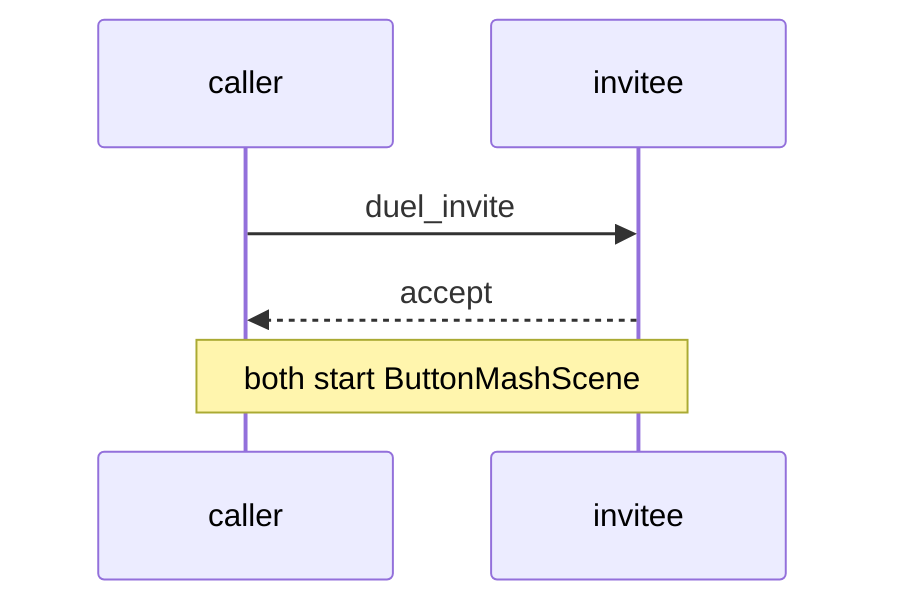

# Mini-Game Task 4.0 – Invite / Accept UI

## UI Components
- **Duel Button** in `DashboardScene`
- **DuelInviteModal**
  • Lists `presence` users
  • "Invite" button per row
- **Toast** for incoming invite

## Flow Diagram


> 📝 **Host Rule:** The duel **host** is the player whose `auth.uid` sorts
> first alphabetically; this decides who sends `start` / `finish`.

## Edge Cases
- Invitee declines → toast to caller.
- Invitee disappears → caller sees "player unavailable".

## API Surface
```js
sendDuelInvite(inviteeId)            // via realtime
listenForDuelInvites(callback)
```

### Realtime Message Payloads

```jsonc
// caller → invitee
{
  "type": "duel_invite",
  "gameId": "uuid-active-game",
  "duelId": "uuid",
  "from": { "id": "uuid", "name": "Alice" },
  "ts": 1690000000456,
  "expiresInMs": 30000   // 30-second accept window
}

/* invitee → caller */
{
  "type": "duel_response",
  "duelId": "uuid",
  "accepted": true,
  "ts": 1690000003123
}
```

### DuelInviteModal Fields

| Field | Widget | Notes |
| ----- | ------ | ----- |
| Player list | Scrollable list, each row shows avatar, username, win/loss badge |
| Invite button | Neon-blue button per row | Disabled if invite already pending |
| Invite countdown | Circular progress (30 s) | Auto-decline on 0 |

### Timeout & Retry Rules

1. Caller sends `duel_invite` then starts 30 s timer.
2. If no `duel_response` within 30 s → auto-decline; toast "No response".
3. Caller may re-invite same player **after** 60 s cool-down.
4. Invitee auto-declines if they navigate away from active-game scene.

### Navigation Hooks

- **DashboardScene**: inject `scene.events.on('DUEL_COMPLETE', refreshDashboard)`.
- **ButtonMashScene**: emit `DUEL_COMPLETE` with result payload on shutdown.