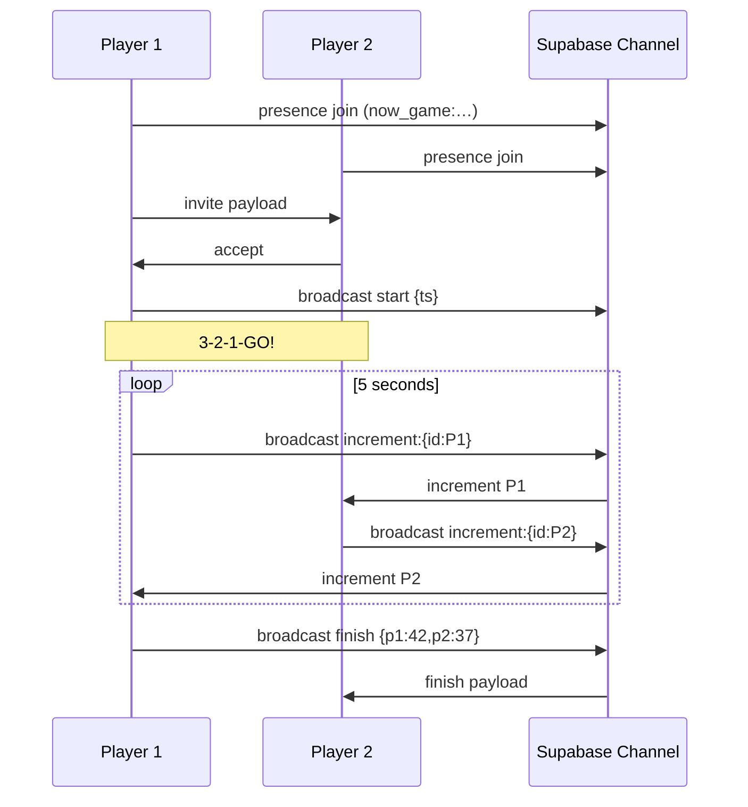

# 💡 Possible Mini-Game Ideas
_A scratch-pad for quick, real-time multiplayer mini-games that can be bolted onto the existing Crypto-Trader Simulator without disrupting core schemas._

---

## Idea 1 – **Button-Mash Duel**

### 0. Elevator Pitch
A five-second, head-to-head "tap as fast as you can" contest.
• Both players see a **3-2-1-GO!** countdown.
• During the 5-second window each key-press (or space-bar tap) increments their on-screen counter.
• Realtime updates show the opponent’s counter in near-real-time.
• At time-up, highest count wins; display *"You Win!"* / *"You Lose…"* and optionally record the outcome as bragging rights.

### 1. Why This Fits
* **Super simple:** only two numeric counters to sync.
* **No impact on price/portfolio tables** – all state is transient.
* **Phaser-friendly:** can live in a tiny `ButtonMashScene` subclass (<150 LOC).
* **Supabase Realtime:** use a dedicated channel (`button_mash:<gameId>:<duelId>`) – no DB writes needed unless we want a record.

### 2. Game Flow
1. **Invite:** From the Now-Mode dashboard a user clicks "Duel" → modal lists currently-online participants (use `presence` on a `now_game:<gameId>` channel).
2. **Accept:** Invitee clicks "Accept" → both clients navigate to `ButtonMashScene`.
3. **Countdown:** Host sends `start` event with server timestamp; both countdown locally.
4. **Mash Phase (5 s):**
   * Each key-press → `increment:{playerId}` broadcast.
   * Clients locally increment their own counter immediately; opponent’s counter updates on receipt.
5. **Finish:** At +5 s host sends `finish` message containing final tallies.
6. **Result Screen:** Simple text, "Alice 42 vs Bob 37 – Alice Wins!".
7. **Return:** Acknowledge → back to dashboard.

### 3. Technical Sketch

#### Supabase Realtime


#### Phaser Scene Outline
```js
class ButtonMashScene extends Phaser.Scene {
  init({ duelId, channel }) { this.channel = channel; }
  create() {
    this.myCount = 0; this.otherCount = 0;
    this.input.keyboard.on('keydown', () => {
      if (!this.isMashing) return;
      this.myCount++;
      this.updateMyText();
      this.channel.send({ type: 'increment', id: this.user.id });
    });
    // channel.on message handlers …
  }
}
```

### 4. Minimal Data Addition (Optional)
*Table:* `mini_game_duels`
| column | type | notes |
|---|---|---|
| id | uuid | primary key |
| game_id | uuid | FK active_games |
| winner_id | uuid | FK profiles |
| created_at | timestamptz | default now() |

No schema touch is required if we skip persistence.

### 5. Effort Estimate
| Task | ETA |
| ----- | --- |
| Frontend scene + UI (Phaser) | 2 h |
| Realtime channel wiring | 1 h |
| Invite modal in dashboard | 1 h |
| Optional DB table & Edge fn record | 0.5 h |
| **Total** | **~4.5 h** (skip DB: 4 h) |

### 6. Risk & Mitigation
* **Latency desync** – use host timestamp for official end.
* **Spam** – throttle key events (e.g. max 20 msg/s).
* **Edge cases** – handle disconnect; auto-forfeit if opponent leaves.

### 7. Future Polish Ideas
1. Leaderboard of fastest fingers (total CPM).
2. Variant with alternating keys (A-S-A-S…) to prevent key-repeat spam.
3. Cosmetic "laser race" visual instead of numbers.

### 8. Complexity vs Existing Project

If you were able to build the core (historical + Now-mode) multiplayer in roughly **4–5 days**, this mini-game is _very small_ in comparison.

* **Estimated hands-on time:** 4 – 6 hours total
  * 2 h – Phaser scene & UI
  * 1 h – Supabase Realtime channel wiring
  * 1 h – Invite/accept modal + dashboard hook-up
  * 0.5 h – Polishing & bug-bash
  * 0.5 h – (Optional) persisting duel results

* **Why it’s lightweight**
  1. **No schema coupling** – all state can live in a transient realtime channel.
  2. **No price logic** – avoids the heavy crypto logic & cron workflow.
  3. **Isolated scene** – can be dropped into `scenes/ButtonMashScene.js` without touching existing scenes.
  4. **Reusable presence data** – you already query "players online" for dashboard; reuse that.

* **Prerequisites / Gotchas**
  - You need a basic Supabase Realtime channel helper (`realtime.js`) if one doesn’t exist.
  - Both clients must be on the same Origin for Realtime auth to work.
  - Remember to throttle key-events (<20 msg/s) to avoid hitting Realtime limits.

Given the above, adding **Button-Mash Duel** is a *nice-to-have* polish feature that should fit comfortably into a single evening after core functionality is stable.