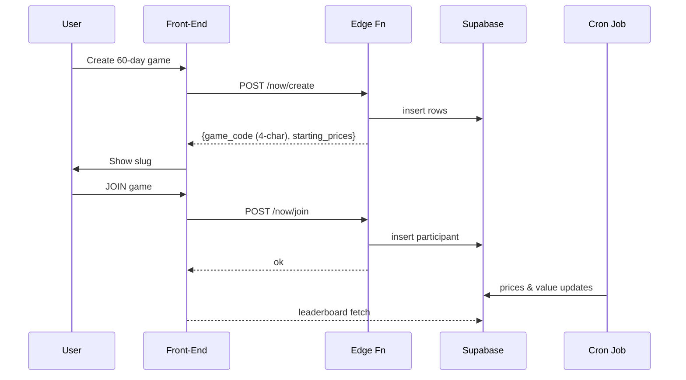

# 📈 Future / Now-Mode Multiplayer – Implementation Plan **v2**

This document is a Phase-aligned expansion of the high-level checklist.
Each numbered Phase (0–6) below **matches one-for-one** with the sections
in `future-multiplayer-checklist.md`, so you can jump back and forth
without mental re-mapping.

---

## Continuing Questions & Concerns
* **Late-Join Handicap** – deferred; revisit once core flow is stable.
* **Real-time vs polling** – current plan uses 5-min polling; WebSocket
  upgrade tracked for v1.1.
* **Cheat Protection** – server-side allocation validation remains open.
* **Private / invite-only games** – out of scope for v1.0.

---

## Problem Statement
We already support **Past-mode** (fast 15–30 s simulations).
**Now-mode** (30 / 60 / 90 day real-time challenges) works for a single
player but lacks robust multiplayer support.
Goals for this sprint: see players create, join and track Now-mode games
with locked price baselines and a live leaderboard, while keeping
Past-mode intact.

---

## Key Design Decisions
| Topic | Decision | Rationale |
| ----- | -------- | --------- |
| **Price baseline** | **Lock prices at game-creation** (`starting_prices`) | Simplest, fair for all players |
| **Join window** | **Open until game end** | Keeps flow simple; no extra states |
| **Slug / Game Code** | 4-char mixed-case alphanumeric (`36⁴` combos) | Short for UI & manual entry |
| **Schema** | `active_games` + `game_participants` | Scales, isolates per-player state |
| **Updates** | Cron job every 5 min updates games & participants | Centralised, stateless |

---

# Phase Sections

### Phase 0 – Pre-work (Lightweight Scene Split)
**Goal:** Reduce `game.js` from 5 000 LOC into manageable modules before
touching multiplayer logic.

**Tasks**
- Extract each Phaser **Scene** class into its own file under
  `/scenes/<SceneName>.js`; target ≤ 1 000 LOC each (ideal ≤ 500).
- Create a slim bootstrap (`index.js` or stub `game.js`) that registers
  all scenes with Phaser.
- No logic changes; purely mechanical file moves.

**Estimate:** 3 h

---

### Phase 1 – Database & Security
**Goal:** Add columns & Row-Level Security required for multiplayer.

**Migration 004**
```sql
ALTER TABLE public.active_games
  ADD COLUMN IF NOT EXISTS game_code TEXT UNIQUE,
  ADD COLUMN IF NOT EXISTS is_multiplayer BOOLEAN DEFAULT FALSE,
  ADD COLUMN IF NOT EXISTS participant_count INT DEFAULT 1;

CREATE INDEX IF NOT EXISTS idx_active_games_code
  ON public.active_games(game_code);
```

**RLS Sketch**
```sql
-- active_games
CREATE POLICY "Public view open multiplayer"
  ON public.active_games
  FOR SELECT USING (is_multiplayer AND NOT is_complete);

CREATE POLICY "Owner manage game"
  ON public.active_games
  FOR UPDATE USING (auth.uid() = user_id);

-- game_participants
CREATE POLICY "Row owner manage participation"
  ON public.game_participants
  USING (auth.uid() = user_id);
```

**Checklist-mapped Tasks**
- Write Migration 004 (above).
- Verify `game_participants` table (Migration 003) exists.
- Apply / update RLS policies.

**Estimate:** 0.5 h

---

### Phase 2 – Backend Functions
**Goal:** Provide secure CRUD endpoints & scheduled updates.

| Function | Trigger | Responsibility |
| -------- | ------- | -------------- |
| `create_game` | POST `/api/now/create` | Validate payload, generate 4-char slug, insert `active_games`, add creator to `game_participants`. |
| `join_game` | POST `/api/now/join` | Prevent duplicate join, insert participant, bump `participant_count`. |
| `update_active_games` | Cron 5 min | Update prices & values; mark complete when `NOW() > ends_at`. |

**Data-flow Overview**

*Implementation standardises on 4-character slug.*

**Estimate:** 2 h (create + join + cron)

---

### Phase 3 – Front-End Service Layer
**Goal:** Hide Edge-function calls behind a thin client API.

- `services/nowGameApi.js`
  ```js
  export async function createNowGame({ userId, duration, allocations }) { … }
  export async function joinNowGame({ gameId, allocations }) { … }
  ```
- `utils/slug.js` – client-side 4-char slug generator for tests/fallbacks.

**Estimate:** 0.5 h

---

### Phase 4 – Scene Updates
**Goal:** Wire the UI to the new backend & DB shape.

| Scene | Additions |
| ----- | --------- |
| **NowModeSetupScene** | Call `create_game`, display slug |
| **DashboardScene** (Active tab) | List open games, **JOIN** button |
| **AllocationScene** | When joining, use `starting_prices`, call `join_game` |
| **ActiveGameViewScene** | Real-time leaderboard (participant values) |

**Estimate:** 3 h

---

### Phase 5 – QA & Polish
**Goal:** Verify stability and UX.

- Manual multi-account create/join flow.
- Edge-case: join near game end.
- Regression test Past-mode.
- UI colour & copy pass.

**Estimate:** 1 h

---

### Phase 6 – Deploy & Monitor
**Goal:** Ship to production and add observability.

- Deploy Edge functions and schedule cron job.
- Add logging / alerts.
- Post-deploy smoke test.

**Estimate:** 0.5 h

---

## Summary Timeline
| Phase | Owner | ETA |
| ----- | ----- | --- |
| 0 | FE | 3 h |
| 1 | BE | 0.5 h |
| 2 | BE | 2 h |
| 3 | FE | 0.5 h |
| 4 | FE | 3 h |
| 5 | ALL | 1 h |
| 6 | DevOps | 0.5 h |

---

*This Plan v2 is now **strictly ordered** by Phase number to mirror the
checklist.  Consult the matching heading here whenever you need deeper
details about a checklist item.*