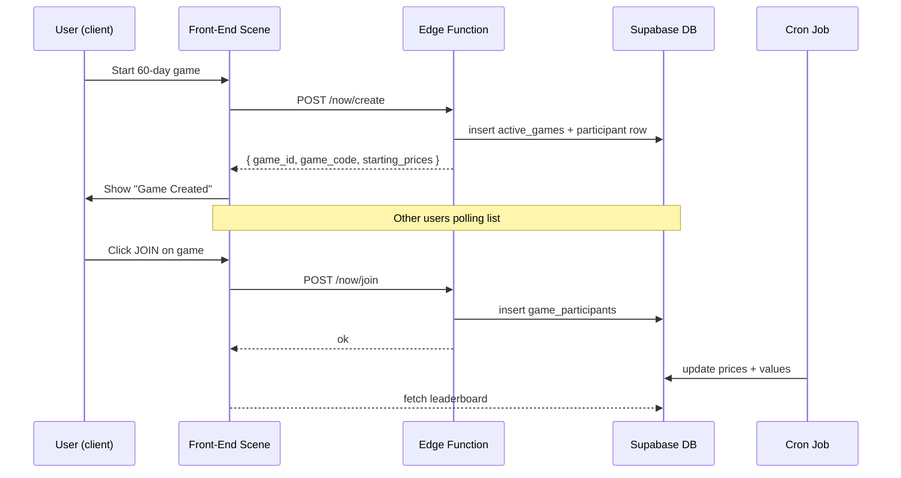

# 📈 Future / Now-Mode Multiplayer – Implementation Plan (v1.0)

_Audience: dev team – use this as the single source of truth while refactoring the broken "future" multiplayer._


## ✋ Is the refactor mandatory for the MVP / PoC?

Short answer: **a lightweight split is strongly recommended, but a full deep refactor can wait.**

*Pros of doing a quick split now*
1. `game.js` at ~5 000 LOC currently blows past AI context limits – even small edits become brittle.
2. Most of the up-coming multiplayer changes touch only a handful of scenes (`DashboardScene`, `AllocationScene`, `NowModeSetupScene`, `ActiveGameViewScene`).  Extracting those scenes into their own files (≈300–800 LOC each) provides immediate win-win: easier human review **and** enables AI-assisted patches.
3. The split is mechanical (move class + exports) and low-risk when done before logic changes.

*Cons / when to defer*
• If the goal is a one-off demo in the next few hours and no further code iterations are planned, refactor cost may outweigh benefit.
• A full layered re-architecture (services, models, utils) is a bigger lift – safe to postpone until after the multiplayer flow proves value.

**Recommended compromise**
1. Perform the “skeleton pass” that moves each Phaser Scene class into its own file (≤1 000 LOC per file).  Time-box: ~2–3 hours.
2. Keep the deeper module breakdown (services / ui / utils) as *nice-to-have* after the PoC ships.

_This compromise keeps the schedule lean while still unlocking maintainability and AI leverage for the upcoming multiplayer work._


## ⚠️ Continuing Questions & Concerns
* **Late-Join Handicap** – still deferred; revisit once core flow is stable.
* **Real-time vs polling** – current plan uses 5-min polling; websocket upgrade tracked for v1.1.
* **Cheat Protection** – server-side allocation validation remains open.
* **Private / invite-only games** – out of scope for v1.0, revisit later.

---

## 1. Problem Statement

* We already support **Past-mode** simulations (instant 15–30 s runs ➜ results saved to `past_runs`).
* **Now-mode** (30/60/90 **days**) was bolted on and half-works for a **single** player.
* True multiplayer for Now-mode (many players, joinable after start, rolling price updates) is unreliable / missing.

Goals for this sprint:

1. Ship a **basic but robust** future multiplayer:
   - Any user can **create** a 30/60/90-day game.
   - Others can **discover & join** while it is open.
   - Values update every 5 min from CoinGecko.
   - Dashboard shows participant ranking & each user’s portfolio view.
2. Keep Past-mode 100 % intact.
3. Design the data model so we can later add:
   - Variable buy-in windows, late-join balancing, chat, trophies, etc.

---

## 2. Key Design Decisions

| Topic | Decision | Rationale |
|-------|----------|-----------|
| **Price baseline** | **Lock prices at game-creation** and store in `starting_prices`. | Simplest, fair for all players. |
| **Join window** | **Allow joining until game end** (no hard cut-off). | Keeps flow simple; no extra states. |
| **Slug / game code** | 4-character alphanumeric (0-9, a-z, A-Z) **e.g. `A7bQ`** giving 1.7 M combos (`36^4`). | Short enough to type & display while highly unlikely to collide. |
| **Schema approach** | Keep `active_games` + `game_participants` (junction). | Scales, matches current work. |
| **Updates** | Cron job every 5 min updates games & participants. | Centralised, stateless. |

| **Schema approach** | Keep `active_games` for game meta + 1-row per game.
Create / keep `game_participants` as junction table (1-row per player per game). | Mirrors current attempt, scales to N players, isolates per-player state. |
| **Updates** | Edge function `cron/update_active_games` every 5 min:
  1. Fetch latest prices → update each game’s `current_prices` & `current_value`.
  2. Re-compute each participant’s `current_value`. | Centralised, stateless worker; no client load. |
| **RLS** | `active_games`: public read for open multiplayer, row-owner read/write otherwise.
`game_participants`: row-owner read/write. | Prevent cheating; still allow leaderboard. |

---

## 3. Database Changes (Supabase)

```sql
-- 1. active_games extras
ALTER TABLE public.active_games
    ADD COLUMN IF NOT EXISTS game_code TEXT UNIQUE,
    ADD COLUMN IF NOT EXISTS is_multiplayer BOOLEAN DEFAULT FALSE,
    ADD COLUMN IF NOT EXISTS participant_count INT DEFAULT 1;

-- 2. Ensure existing game_participants table from migration 003 is present (see repo)
--    If not, run migration 003 again.

-- 3. Index game_code for quick lookup
CREATE INDEX IF NOT EXISTS idx_active_games_code ON public.active_games(game_code);
```

### RLS Policies (sketch)

```sql
-- active_games
CREATE POLICY "Public view open multiplayer"
  ON public.active_games
  FOR SELECT USING (is_multiplayer = TRUE AND is_complete = FALSE);

CREATE POLICY "Owner manage game"
  ON public.active_games
  FOR UPDATE USING (auth.uid() = user_id);

-- game_participants
CREATE POLICY "Row owner manage participation"
  ON public.game_participants
  USING (auth.uid() = user_id);
```

*Full SQL in `/supabase/migrations/004_future_multiplayer.sql` to be created.*

---

## 4. Backend (Edge Functions)

| Function | Trigger | Responsibility |
|----------|---------|----------------|
| `create_game.ts` | HTTPS POST `/api/now/create` | Validate payload, generate `game_code`, insert row, add creator to `game_participants`. |
| `join_game.ts` | HTTPS POST `/api/now/join` | Validate `game_id`, prevent dup join, insert into `game_participants`, bump `participant_count`. |
| `update_active_games.ts` | Cron **every 5 min** | Fetch latest prices; loop games where `is_complete = FALSE`; update game & participants values; mark complete when `NOW() > ends_at`; optionally compute final leaderboard snapshot. |

Tech stack: TypeScript + Supabase Edge Runtime (`@supabase/functions`).

---

## 5. Front-End Changes (Phaser)

### 5.1 Scene Adjustments

| Scene | What to add / tweak |
|-------|---------------------|
| **NowModeSetupScene** | Generate game via `create_game` endpoint (instead of direct DB insert). Receive `game_code`. |
| **DashboardScene** | In **Active** tab: <br>• Render list of open games (multiplayer only) sorted by `created_at DESC`. <br>• Show `JOIN` button that calls `join_game` then pushes to `AllocationScene`. |
| **AllocationScene** | Detect `joiningMultiplayer=true` in data payload → skip price fetch, use `starting_prices` passed from game. After lock-in, call `join_game` **or** confirm existing participant row update. |
| **NowModeResultScene** | Show "Game Created" vs "Joined Game" confirmation with `game_code`. |
| **ActiveGameViewScene** | For multiplayer: <br>• Poll (or subscribe) `active_games` & `game_participants` to render leaderboard. <br>• Highlight current user. |

### 5.2 New Helper Module

`services/nowGameApi.js` – thin wrapper around Edge function calls (create / join).

```js
export async function createNowGame({ userId, duration, allocations }) { … }
export async function joinNowGame({ gameId, allocations }) { … }
```

---

## 6. Data Flow Summary



`game_code` is a **4-character** mixed-case alphanumeric slug (e.g. `A7bQ`) – short enough to type yet offers ~1.7 million unique combinations.

---
 
## 🛠️ Codebase Refactor – Split `game.js`

`game.js` is ~5 000 LOC.  A **surgical "scene extraction" pass _before_ the multiplayer overhaul** will:

1. Move each Phaser Scene class into its own file inside `scenes/` (goal ≤ 1 000 LOC each, ideal ≤ 500).
2. Leave deeper module layering (services / UI / utils) for later.
3. Add a central `index.js` that imports all scenes and bootstraps Phaser.

_Practical impact_:
• Reduces file size for easier AI-assisted edits.
• Speeds human code review & lowers merge-conflict risk.
• Takes ≈ **3 hours** for one dev (rename + import fix, no logic change).

If schedule is **extremely** tight, you *could* skip this, but every subsequent code change will be harder. **Recommendation: do the split.**

 
## 7. Implementation Steps & Estimates

| Step | Owner | ETA |
|------|-------|-----|
| **0. Pre-work – Lightweight scene split** | FE | **3 h** |
| 1. Write migration 004 – new cols + policies | BE | 0.5 h |
| 2. Edge function `create_game` | BE | 1 h |
| 3. Edge function `join_game` | BE | 0.5 h |
| 4. Edge cron `update_active_games` | BE | 1 h |
| 5. Front-end service layer (`nowGameApi.js`) | FE | 0.5 h |
| 6. Update `NowModeSetupScene` → use API | FE | 0.5 h |
| 7. Update `DashboardScene` active list (JOIN button) | FE | 1 h |
| 8. Update `AllocationScene` flow | FE | 1 h |
| 9. Update `ActiveGameViewScene` leaderboard | FE | 1.5 h |
| 10. QA & bug-bash | All | 1 h |

_**Total** ≈ **12 h** including refactor._

`game_code` now uses a **4-char** slug (e.g. `A7bQ`).

---

## 8. Open Questions

1. **Late-Join Handicap** – do we want to apply a pro-rated duration penalty? (Not in v1.)
2. **Real-time Subscriptions** – switch from polling to `realtime` channel later.
3. **Cheat Protection** – consider server-side validation of allocations (<=10 blocks).
4. **Game Visibility** – should private games exist with invite-only code?
5. **Final Leaderboard** – store snapshot to static `leaderboard` table on completion?

---

## 9. Future Enhancements

* Dynamic buy/sell during game (turn-based trading).
* Notifications ("You moved up to #3!").
* In-game chat per multiplayer session.
* Mobile push / PWA offline support.

---

## 10. Next Action

Start with **migration 004** and the **create / join** edge functions; once the DB & API layer are stable the front-end tweaks can be parallelised.

**Let’s ship!** 🚀