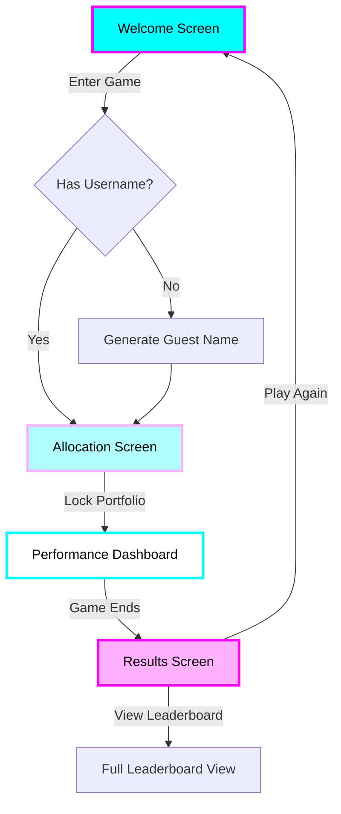

# Complete Screen Designs - Crypto Trading Sim

## Color Palette
Based on your gradient image:
- **Background**: #000000 (Pure Black)
- **Cyan**: #00FFFF (Bright Cyan)
- **Light Cyan**: #B0FFFF (Soft Cyan)
- **White**: #FFFFFF (Pure White)
- **Light Pink**: #FFB0FF (Soft Pink)
- **Magenta**: #FF00FF (Bright Magenta)
- **Text on Light**: #000000 (Black)
- **Text on Dark**: #FFFFFF (White)

## Screen 1: Welcome/Login Screen

```
┌────────────────────────────────────────────────────────┐
│                    [BLACK BACKGROUND]                   │
│                                                        │
│     ╔═══════════════════════════════════════╗         │
│     ║          CRYPTO TRADER SIMULATOR       ║         │
│     ╚═══════════════════════════════════════╝         │
│         [Title in gradient: Cyan → Pink]               │
│                                                        │
│     ┌─────────────────────────────────────┐          │
│     │  Choose Your Display Name:          │          │
│     │  [_____________________]            │          │
│     │         (Optional)                  │          │
│     └─────────────────────────────────────┘          │
│            [Box: Light Cyan background]                │
│                                                        │
│     ┌─────────────────────────────────────┐          │
│     │       ENTER THE GAME                │          │
│     └─────────────────────────────────────┘          │
│          [Button: Magenta → Pink gradient]             │
│                                                        │
│     Current Game: 2,847 Players Competing              │
│     Time Remaining: 16:34:22                           │
│         [Text in soft cyan]                            │
└────────────────────────────────────────────────────────┘
```

### Build Requirements:
- Canvas with black background (#000000)
- Title with gradient shader (Cyan → Pink)
- Input field with light cyan background
- Button with gradient fill and glow effect
- Live game stats at bottom

## Screen 2: Portfolio Allocation

```
┌────────────────────────────────────────────────────────┐
│                    [BLACK BACKGROUND]                   │
│                                                        │
│     ALLOCATE YOUR 100 POINTS                          │
│     [Header: Cyan gradient text]                       │
│                                                        │
│  ┌──────────────────────────────────────────────┐    │
│  │  BTC  Bitcoin         $67,234    ▲ +2.3%    │    │
│  │  ████████████░░░░░░░  35 pts                │    │
│  │  [Progress bar: Cyan gradient]               │    │
│  └──────────────────────────────────────────────┘    │
│                                                        │
│  ┌──────────────────────────────────────────────┐    │
│  │  ETH  Ethereum        $3,456     ▲ +3.1%    │    │
│  │  ██████████░░░░░░░░░  30 pts                │    │
│  │  [Progress bar: Light Cyan]                  │    │
│  └──────────────────────────────────────────────┘    │
│                                                        │
│  ┌──────────────────────────────────────────────┐    │
│  │  BNB  Binance Coin    $421       ▼ -1.2%    │    │
│  │  ██████░░░░░░░░░░░░░  20 pts                │    │
│  │  [Progress bar: White]                       │    │
│  └──────────────────────────────────────────────┘    │
│                                                        │
│  ┌──────────────────────────────────────────────┐    │
│  │  SOL  Solana          $156       ▲ +5.4%    │    │
│  │  ███░░░░░░░░░░░░░░░░  10 pts                │    │
│  │  [Progress bar: Light Pink]                  │    │
│  └──────────────────────────────────────────────┘    │
│                                                        │
│  ┌──────────────────────────────────────────────┐    │
│  │  XRP  Ripple          $0.64      ▲ +0.8%    │    │
│  │  █░░░░░░░░░░░░░░░░░░  5 pts                 │    │
│  │  [Progress bar: Magenta]                     │    │
│  └──────────────────────────────────────────────┘    │
│                                                        │
│     Points Used: 100/100 ✓                            │
│     [Green when complete, red when over/under]        │
│                                                        │
│     ┌─────────────────────────────────────┐          │
│     │         LOCK IN PORTFOLIO           │          │
│     └─────────────────────────────────────┘          │
│        [Button: Magenta with glow effect]              │
└────────────────────────────────────────────────────────┘
```

### Build Requirements:
- Each crypto row is a prefab with:
  - Icon slot
  - Name/price display
  - Up/down arrow (green/red)
  - Slider with gradient fill
  - Point display
- Validation logic for 100 points
- Lock button pulses when ready

## Screen 3: Live Performance Dashboard

```
┌────────────────────────────────────────────────────────┐
│                    [BLACK BACKGROUND]                   │
│                                                        │
│  ┌──────────────────────────────────────────────┐    │
│  │  YOUR PORTFOLIO:  $10,234,567                │    │
│  │  RETURN: +2.35%   RANK: #127/2,847          │    │
│  └──────────────────────────────────────────────┘    │
│     [Header box: Cyan → Pink gradient border]         │
│                                                        │
│  ┌──────────────────────────────────────────────┐    │
│  │  ASSET PERFORMANCE                           │    │
│  │                                              │    │
│  │  BTC (35%)  $3,584,348   ▲ +2.41%          │    │
│  │  ████████████████████████████               │    │
│  │                                              │    │
│  │  ETH (30%)  $3,098,223   ▲ +3.26%          │    │
│  │  ██████████████████████████                 │    │
│  │                                              │    │
│  │  BNB (20%)  $1,956,445   ▼ -2.18%          │    │
│  │  ████████████████                           │    │
│  │                                              │    │
│  │  SOL (10%)  $1,054,234   ▲ +5.42%          │    │
│  │  ██████████                                 │    │
│  │                                              │    │
│  │  XRP (5%)   $541,317     ▼ -0.67%          │    │
│  │  █████                                      │    │
│  └──────────────────────────────────────────────┘    │
│     [Performance bars use gradient colors]            │
│                                                        │
│  ┌──────────────────────────────────────────────┐    │
│  │  TOP PERFORMERS                              │    │
│  │  1. CryptoKing     +8.23%                   │    │
│  │  2. MoonShot       +7.95%                   │    │
│  │  3. DiamondHands   +7.82%                   │    │
│  │  ...                                         │    │
│  │  127. YOU          +2.35% ← [Highlighted]   │    │
│  └──────────────────────────────────────────────┘    │
│                                                        │
│     Game Ends In: 16:34:22                            │
│     [Countdown timer in cyan]                          │
└────────────────────────────────────────────────────────┘
```

### Build Requirements:
- Real-time value updates with smooth transitions
- Performance bars animate on changes
- Leaderboard scrolls to player position
- Particle effects on rank improvements

## Screen 4: Final Results Screen (Universal)

```
┌────────────────────────────────────────────────────────┐
│                    [BLACK BACKGROUND]                   │
│                                                        │
│              GAME COMPLETE!                            │
│         [Header in gradient text]                      │
│                                                        │
│     ╔═══════════════════════════════════════╗         │
│     ║   CONGRATULATIONS! YOU FINISHED        ║         │
│     ║         #127 OUT OF 2,847              ║         │
│     ╚═══════════════════════════════════════╝         │
│          [Box with gradient border]                    │
│                                                        │
│     Final Portfolio: $10,234,567                       │
│     Total Return: +2.35%                               │
│                                                        │
│     ┌─────────────────────────────────┐              │
│     │ PERFORMANCE BREAKDOWN            │              │
│     │ Best Pick:  SOL +5.42%          │              │
│     │ Worst Pick: BNB -2.18%          │              │
│     │ Overall Strategy: MODERATE       │              │
│     └─────────────────────────────────┘              │
│                                                        │
│     ┌─────────────────────────────────────┐          │
│     │         PLAY AGAIN                   │          │
│     └─────────────────────────────────────┘          │
│     ┌─────────────────────────────────────┐          │
│     │      VIEW FULL LEADERBOARD           │          │
│     └─────────────────────────────────────┘          │
└────────────────────────────────────────────────────────┘
```

### Build Requirements:
- Same screen for all players (1st place through last)
- Dynamic rank display (#X out of Y)
- Clean, consistent messaging
- Performance breakdown for learning
- Options to play again or view full results

## Screen Flow Diagram



## Additional UI Elements

### Loading States
- Initial load: Gradient shimmer effect
- Price updates: Subtle pulse on values
- Rank changes: Number slides up/down

### Error States
- Connection lost: Cyan warning banner
- API failure: Falls back to cached prices
- Invalid allocation: Red highlight on total

### Transitions
- Screen changes: Fade through black
- Value updates: Smooth number counting
- Rank changes: Slide animation with glow

## Unity Implementation Notes

1. **Color Management**
   - Create ScriptableObject for color palette
   - Use gradient shaders for all effects
   - HDR colors for glow effects

2. **Responsive Design**
   - Anchor all UI elements properly
   - Test on 16:9, 16:10, 21:9 aspects
   - Scale UI for mobile (future)

3. **Performance**
   - Pool particle effects
   - Batch UI updates
   - Use object pooling for leaderboard rows 