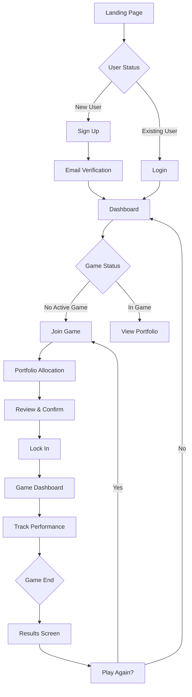

# UI Design - Crypto Trading Simulation

## User Interface Mockups

### 1. Landing Page
```
┌────────────────────────────────────────────────────┐
│  CryptoSim 🚀            [Login] [Sign Up]         │
├────────────────────────────────────────────────────┤
│                                                    │
│     Trade Like a Pro, Risk Nothing                 │
│                                                    │
│     Compete with $10M in virtual funds             │
│     Trade top 5 cryptocurrencies                   │
│     Win real bragging rights                       │
│                                                    │
│            [ Start Playing Now ]                    │
│                                                    │
│  Current Game: Ends in 18:34:22                   │
│  Players: 234 | Prize Pool: Glory                 │
└────────────────────────────────────────────────────┘
```

### 2. Portfolio Allocation Screen
```
┌────────────────────────────────────────────────────┐
│  Allocate Your $10,000,000                    [X]  │
├────────────────────────────────────────────────────┤
│                                                    │
│  Bitcoin (BTC)        $43,567.23                   │
│  [=========|==============] 35%    $3,500,000      │
│                                                    │
│  Ethereum (ETH)       $2,234.56                    │
│  [=============|==========] 45%    $4,500,000      │
│                                                    │
│  BNB                  $312.45                      │
│  [===|====================] 10%    $1,000,000      │
│                                                    │
│  Solana (SOL)         $98.76                       │
│  [=|======================] 5%     $500,000        │
│                                                    │
│  XRP                  $0.5432                      │
│  [=|======================] 5%     $500,000        │
│                                                    │
│  Remaining: 0%        Total: 100% ✓               │
│                                                    │
│  [ Reset ]                    [ Lock In Portfolio ] │
└────────────────────────────────────────────────────┘
```

### 3. Dashboard (During Game)
```
┌────────────────────────────────────────────────────┐
│  Dashboard          Time Remaining: 16:42:18   [⚙] │
├────────────────────────────────────────────────────┤
│                                                    │
│  Your Portfolio Value: $10,234,567 (+2.35%)        │
│  Your Rank: #12 of 234                            │
│                                                    │
│  ┌─────────────────┐  ┌────────────────────────┐  │
│  │ Portfolio       │  │ Performance Chart      │  │
│  │ BTC: 35% ▲2.1% │  │     ╱╲    (Your line)  │  │
│  │ ETH: 45% ▲3.2% │  │   ╱╲╱ ╲                │  │
│  │ BNB: 10% ▼1.2% │  │  ╱     ╲               │  │
│  │ SOL: 5%  ▲5.4% │  │ ╱       ╲              │  │
│  │ XRP: 5%  ▼0.3% │  │╱         ╲ (Average)   │  │
│  └─────────────────┘  └────────────────────────┘  │
│                                                    │
│  Top Performers                                    │
│  1. CryptoKing    +5.23%    $10,523,000          │
│  2. MoonShot      +4.87%    $10,487,000          │
│  3. HODLmaster    +4.12%    $10,412,000          │
└────────────────────────────────────────────────────┘
```

### 4. Results Screen
```
┌────────────────────────────────────────────────────┐
│  Game Results - Round #42                          │
├────────────────────────────────────────────────────┤
│                                                    │
│         🏆 Final Standings 🏆                       │
│                                                    │
│  Your Final Position: #12 of 234                   │
│  Your Return: +2.35% ($10,234,567)                │
│                                                    │
│  Winner: CryptoKing                                │
│  Winning Portfolio:                                │
│  • SOL: 60% (gained +12.3%)                       │
│  • ETH: 30% (gained +4.2%)                        │
│  • BTC: 10% (gained +1.1%)                        │
│                                                    │
│  Your Best Pick: ETH (+3.2%)                      │
│  Your Worst Pick: BNB (-1.2%)                     │
│                                                    │
│  [ View Full Leaderboard ]  [ Play Again ]        │
└────────────────────────────────────────────────────┘
```

## User Flow



## Design Principles

### Visual Design
- **Color Scheme**: Dark theme with green (profits) and red (losses)
- **Typography**: Clean, modern sans-serif (Inter, Roboto)
- **Icons**: Cryptocurrency logos for each coin
- **Charts**: Real-time updating line charts

### Interaction Design
- **Sliders**: Smooth, responsive with instant feedback
- **Tooltips**: Show exact values and calculations
- **Animations**: Subtle transitions for value changes
- **Mobile**: Touch-friendly slider controls

### Responsive Breakpoints
- **Mobile**: 320px - 768px (vertical sliders)
- **Tablet**: 768px - 1024px (compact layout)
- **Desktop**: 1024px+ (full dashboard view)

## Component Library

### Reusable Components
1. **CoinSlider**: Allocation slider with icon and value
2. **PortfolioChart**: Real-time performance visualization
3. **Leaderboard**: Paginated ranking table
4. **CountdownTimer**: Game time remaining
5. **PriceDisplay**: Live price with change indicator
6. **ProgressBar**: Visual allocation feedback

### State Management
- **Global State**: User info, game status, portfolio
- **Local State**: Slider positions, UI preferences
- **Real-time Updates**: WebSocket for prices/rankings 